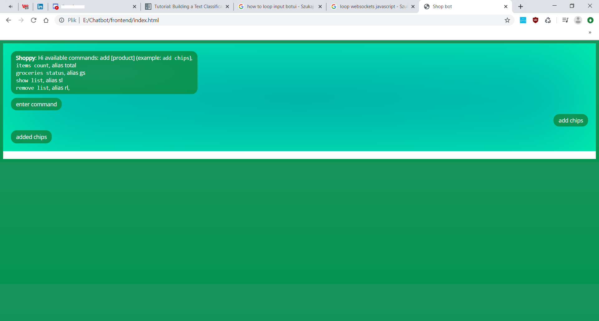

# shopbot





A shopping bot implemented in Python, utilizing Naive Bayes classification and Market Basket Analysis.

## Overview

ShopBot is designed to assist users in making informed shopping decisions by analyzing purchase patterns and providing recommendations.

## Features

- **Naive Bayes Classification**: Classifies items based on user preferences and historical data.
- **Market Basket Analysis**: Identifies associations between products to suggest complementary items.
- **BotUI Frontend**: Provides an interactive conversational interface for user interactions.

## Known Issues

- There is a known problem with the ordering of messages in the chat interface, which may affect the user experience.
  
## Installation

1. Clone the repository:

   ```bash
   git clone https://github.com/grzesiekmq/shopbot.git
   ```
2. Navigate to the project directory:

cd shopbot


3. Install the required Python packages:

pip install -r requirements.txt


4. Run the chatbot:

python chatbot.py


5. Open frontend/index.html in a web browser to interact with the bot.


## Project Structure

shopbot/
├── chatbot.py           # Main bot logic
├── frontend/
│   └── index.html      # Frontend interface
├── requirements.txt    # Python dependencies
└── README.md           # Project documentation

## License

MIT License


---

README assisted by ChatGPT.
